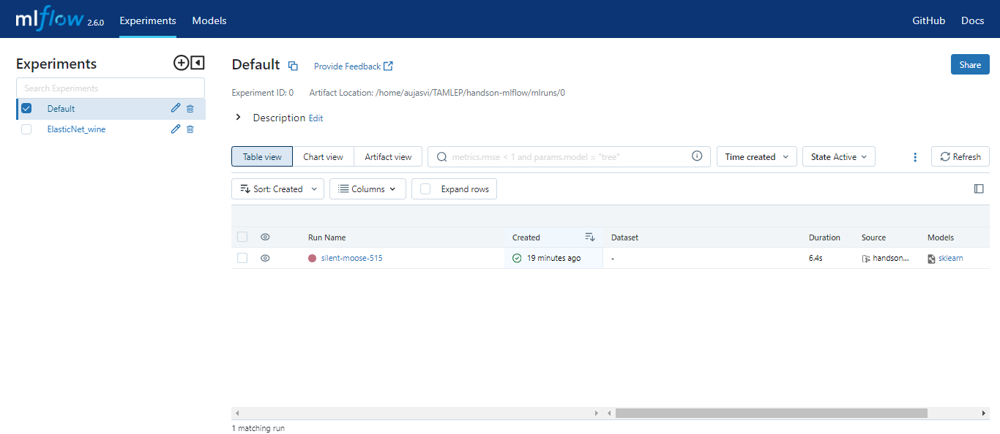
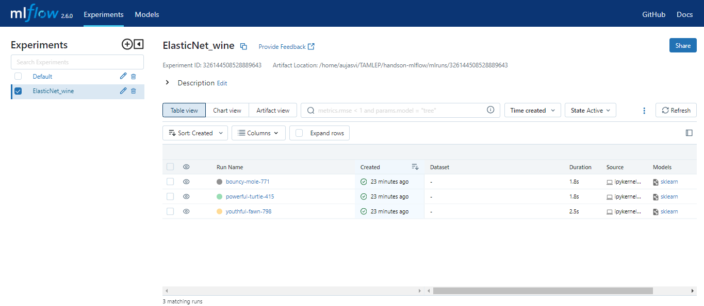

# Handson practice of MLFlow on Wine Quality dataset.

This is a handson practice for mlflow, following the conference from pydata berlin 2019.

## MLFlow command:

- Initiate/Launch MLFlow server:
`mlflow server --backend-store-uri mlruns/ --default-artifact-root mlruns/ --host 0.0.0.0 --port 5000`

- Run MLFlow project:
`mlflow run . -P alpha=0.42`

- Deploy the model locally:
`mlflow models serve -m mlruns/0/<run_id>/artifacts/model/ -h 0.0.0.0 -p 1234`

- Build a docker image:
`mlflow models build-docker -m mlruns/<experiment_id>/<run_id>/artifacts/model/ -n elastic_net_wine`

- Run docker container:
`docker run -p 8080:8080 elastic_net_wine`

## Mlflow UI:

- Default Experiment:

-ElasticNet_wine Experiment:

